# ⚙️ Build Optimization in Frontend System Design

> **Series**: Frontend Performance & Optimization  
> **Chapter**: Build Optimization  
> **Goal**: Understand bundlers, how they work, and every technique to ship faster, smaller, and smarter.

---

## Table of Contents

1. [What is a Bundler?](#1-what-is-a-bundler)
2. [Popular Bundlers Compared](#2-popular-bundlers-compared)
3. [Customer Experience Optimizations](#3-customer-experience-optimizations)
   - Code Splitting
   - Tree Shaking
   - Minification & Obfuscation
   - CSS Pruning & Optimization
   - Compression
   - Image & Asset Optimization
   - Source Maps
   - Bundle Analysis
   - Pre-rendering (SSG)
   - Asset Hashing & Cache
   - Vendor Chunk Splitting
4. [Developer Experience Optimizations](#4-developer-experience-optimizations)
   - Faster Builds
   - Parallelisation
   - Cache Management
   - Incremental Compilation
   - Hot Module Replacement (HMR)
   - Monorepos
5. [Quick Reference Cheatsheet](#quick-reference-cheatsheet)

---


## 1. What is a Bundler?

A bundler is a build tool that takes your source files and produces an **optimised, compatible output** for the browser.

```
INPUT                          BUNDLER                    OUTPUT
──────                         ───────                    ──────
src/
 ├── index.js    ─────────►  [ Module Graph  ] ──────►  dist/
 ├── App.jsx                 [ Tree Shaking  ]            ├── main.abc123.js   (minified)
 ├── styles.css              [ Code Splitting]            ├── vendor.xyz789.js (vendor)
 ├── logo.png                [ Minification  ]            ├── styles.min.css
 └── utils/                  [ Optimisation  ]            ├── logo.webp
      └── helpers.js         [ Compatibility ]            └── index.html
```

### Three Core Jobs of a Bundler

**Module Management**
Bundlers resolve how files import each other. In Node.js you write `import Button from './Button'` — the browser doesn't understand that natively. The bundler traces the entire **dependency graph** (all files and what they import), then combines them in the right order.

```
index.js
  └── imports App.jsx
        └── imports Button.jsx
              └── imports utils/cn.js
                    └── imports clsx (npm package)
```

The bundler walks this tree, resolves every `import`, and produces one (or more) output files the browser can actually run.

**Optimisation**
Strips dead code, minifies, compresses, splits, and hashes — all the techniques covered in this chapter.

**Development Enhancement**
Hot reload, fast rebuilds, source maps, TypeScript/JSX transforms, and cross-browser polyfills — making the dev experience smooth.

**Cross-Browser Compatibility**
Your code uses modern JS (optional chaining `?.`, nullish coalescing `??`, `async/await`). Older browsers don't understand these. Bundlers use **Babel** or **SWC** to transpile modern JS → compatible JS.

```js
// You write (ES2022):
const name = user?.profile?.name ?? 'Guest';

// Bundler outputs (ES5-compatible):
var _user, _user$profile;
var name = (_user = user) === null || _user === void 0 ? void 0 :
  (_user$profile = _user.profile) === null || _user$profile === void 0 ?
  void 0 : _user$profile.name;
name = name !== null && name !== void 0 ? name : 'Guest';
```

**Asset Management**
Images get optimised and hashed. CSS gets processed (PostCSS, autoprefixer). Fonts get inlined or referenced correctly.

---

## 2. Popular Bundlers Compared

| Bundler | Speed | Config | Best For | Under the Hood |
|---------|-------|--------|----------|----------------|
| **Vite** | ⚡⚡⚡ Fast | Minimal | Modern apps, React, Vue | esbuild (dev), Rollup (prod) |
| **esbuild** | ⚡⚡⚡⚡ Fastest | Manual | Libraries, CLIs, custom pipelines | Written in Go |
| **Rollup** | ⚡⚡ Medium | Medium | Libraries, npm packages | Excellent tree shaking |
| **webpack** | ⚡ Slower | Complex | Large enterprise apps | Most mature, most plugins |
| **Parcel** | ⚡⚡ Fast | Zero config | Prototypes, beginners | Auto-detects config |
| **Turbopack** | ⚡⚡⚡⚡ | Minimal | Next.js apps | Written in Rust |

### When to Choose What

```
New React/Vue project           → Vite (best DX, fast builds)
Publishing an npm library       → Rollup (cleanest output)
Legacy enterprise project       → webpack (most ecosystem support)
Maximum build speed, custom     → esbuild
No config, quick prototype      → Parcel
Next.js 13+ project             → Turbopack (built in)
```

---

## 3. Customer Experience Optimizations

These directly affect your **users** — how fast the page loads and how quickly it becomes interactive.

---

### Code Splitting

**Problem**: If you bundle everything into one `main.js`, users download ALL your code even for pages they never visit.

**Solution**: Split your bundle into multiple chunks. Load only what's needed.

```
WITHOUT code splitting:
  main.js = 2.4MB (homepage + checkout + dashboard + admin + ...)
  User visits homepage → downloads 2.4MB → most never used

WITH code splitting:
  main.js      = 120KB  (shared code)
  home.js      = 80KB   (homepage)
  checkout.js  = 200KB  (loaded only when user goes to checkout)
  dashboard.js = 350KB  (loaded only if user logs in)
```

#### Route-based splitting (most common)

```jsx
// React — lazy load entire pages
import { lazy, Suspense } from 'react';
import { Routes, Route } from 'react-router-dom';

// These chunks only download when the user navigates to that route
const Home      = lazy(() => import('./pages/Home'));
const Checkout  = lazy(() => import('./pages/Checkout'));
const Dashboard = lazy(() => import('./pages/Dashboard'));

function App() {
  return (
    <Suspense fallback={<PageSkeleton />}>
      <Routes>
        <Route path="/"          element={<Home />} />
        <Route path="/checkout"  element={<Checkout />} />
        <Route path="/dashboard" element={<Dashboard />} />
      </Routes>
    </Suspense>
  );
}
```

#### Component-level splitting (for heavy components)

```jsx
// Only load the chart library when the user opens the chart panel
const HeavyChart = lazy(() => import('./components/HeavyChart'));

function Dashboard() {
  const [showChart, setShowChart] = useState(false);

  return (
    <div>
      <button onClick={() => setShowChart(true)}>Show Analytics</button>
      {showChart && (
        <Suspense fallback={<div>Loading chart...</div>}>
          <HeavyChart />
        </Suspense>
      )}
    </div>
  );
}
```

---

### Tree Shaking

**Problem**: You import a library but only use 10% of it. The other 90% still ends up in your bundle.

**Solution**: Tree shaking statically analyses your imports and removes unused exports ("dead code").

```js
// lodash (CommonJS — tree shaking DOES NOT work well)
import _ from 'lodash';
_.debounce(fn, 300);
// Result: entire lodash (70KB) is bundled

// lodash-es (ESM — tree shaking WORKS)
import { debounce } from 'lodash-es';
debounce(fn, 300);
// Result: only debounce (~2KB) is bundled

// Or use direct path imports
import debounce from 'lodash/debounce';
```

```js
// Your own utils file
// utils.js
export function formatDate(d) { /* ... */ }   // ← used
export function parseCSV(str) { /* ... */ }    // ← NOT used anywhere
export function slugify(s) { /* ... */ }       // ← used

// After tree shaking, parseCSV is completely removed from bundle
```

> **Key requirement**: Tree shaking only works with **ES Modules** (`import`/`export`). CommonJS (`require`/`module.exports`) cannot be statically analysed. Prefer `import` everywhere.

---

### Minification

Removes whitespace, shortens variable names, eliminates comments. Typical reduction: **30–60%**.

```js
// Before minification (your source):
function calculateCartTotal(cartItems) {
  // Sum up all items in the cart
  return cartItems.reduce((total, item) => {
    return total + (item.price * item.quantity);
  }, 0);
}

// After minification (production bundle):
function a(b){return b.reduce((c,d)=>c+d.price*d.quantity,0)}
```

```css
/* Before */
.button {
  display: flex;
  align-items: center;
  padding: 12px 24px;
  background-color: #0070f3;
  border-radius: 8px;
}

/* After */
.button{display:flex;align-items:center;padding:12px 24px;background-color:#0070f3;border-radius:8px}
```

| Tool | Language | Notes |
|------|----------|-------|
| **Terser** | JS | Standard for webpack |
| **esbuild** | JS/TS | 10–100× faster than Terser |
| **SWC** | JS/TS | Rust-based, used by Next.js |
| **cssnano** | CSS | PostCSS plugin |
| **LightningCSS** | CSS | Rust-based, extremely fast |

---

### Code Obfuscation

Goes further than minification — actively makes code hard to reverse-engineer.

```js
// Minified (readable if you try):
function a(b){return b.reduce((c,d)=>c+d.price*d.quantity,0)}

// Obfuscated (very hard to reverse):
var _0x3a1b=['reduce','price','quantity'];
(function(_0x2c4d,_0x1a2b){/*...*/})(_0x3a1b,0x1f4);
function _0x4f2a(_0x3e1b){return _0x3e1b[_0x3a1b[0]]((_0x5c2d,_0x6e3f)=>
_0x5c2d+_0x6e3f[_0x3a1b[1]]*_0x6e3f[_0x3a1b[2]],0x0)}
```

> **Use when**: You have proprietary algorithms or business logic you can't expose. Most apps don't need this — minification is sufficient. Obfuscation has a **performance cost** (slightly larger bundle, slower parsing).

---

### Pruning & Optimising CSS

**Problem**: CSS frameworks like Tailwind or Bootstrap include thousands of utility classes. You use maybe 5% of them.

**Solution**: Scan your HTML/JSX, find which classes are actually used, remove everything else.

#### PurgeCSS / Tailwind's built-in purge

```js
// tailwind.config.js
module.exports = {
  content: [
    './src/**/*.{js,jsx,ts,tsx}', // scan these files for used classes
    './public/index.html',
  ],
  // Tailwind only includes classes found in the above files
  theme: { extend: {} },
  plugins: [],
};

// Result:
// Development: ~3.8MB (all Tailwind classes)
// Production:  ~8KB   (only classes you actually used)
```

#### Critical CSS extraction

```html
<!-- Inline only the CSS needed for above-the-fold content -->
<head>
  <style>
    /* Critical CSS — inlined, no network request */
    body{margin:0;font-family:system-ui}
    .hero{padding:4rem;background:#000;color:#fff}
    .nav{display:flex;gap:1rem}
  </style>
  <!-- Rest of CSS loads asynchronously -->
  <link rel="preload" href="/css/main.css" as="style" onload="this.rel='stylesheet'">
</head>
```

Tools: `critters` (by Google), `penthouse`, `critical`.

---

### Compression

Compresses files before they're sent over the network. See the [Network Optimization chapter](./network-optimization.md) for deep coverage.

```
// Vite — enable brotli + gzip compression
import { defineConfig } from 'vite';
import compression from 'vite-plugin-compression';

export default defineConfig({
  plugins: [
    compression({ algorithm: 'brotliCompress' }), // .js.br files
    compression({ algorithm: 'gzip' }),             // .js.gz files
  ],
});
```

| Format | Compression | Browser Support |
|--------|-------------|----------------|
| Gzip | ~70% | Universal |
| Brotli | ~80% | All modern browsers |

---

### Optimizing Images & Assets

Images are typically 50–70% of a page's total weight.

```js
// vite.config.js — image optimization
import { defineConfig } from 'vite';
import imagemin from 'vite-plugin-imagemin';

export default defineConfig({
  plugins: [
    imagemin({
      mozjpeg: { quality: 80 },      // JPEG: 80% quality
      pngquant: { quality: [0.7, 0.9] }, // PNG: lossy compression
      svgo: {},                       // SVG: cleanup unused attrs
      webp: { quality: 80 },         // Convert to WebP
    }),
  ],
});
```

**Use modern image formats:**

```html
<!-- Let browser pick the best format it supports -->
<picture>
  <source srcset="hero.avif" type="image/avif" />  <!-- Best compression -->
  <source srcset="hero.webp" type="image/webp" />  <!-- Wide support -->
    <!-- Fallback -->
</picture>
```

| Format | vs JPEG | Notes |
|--------|---------|-------|
| **WebP** | ~30% smaller | Excellent browser support |
| **AVIF** | ~50% smaller | Newest, best quality/size ratio |
| **SVG** | N/A | Use for icons, logos (scales perfectly) |

---

### Remove Source Maps in Production

Source maps are `.map` files that map your minified code back to original source. Essential for debugging in development. In production:

```
main.abc123.js      → 120KB  (your minified app)
main.abc123.js.map  → 890KB  (the source map)
```

- **Never ship source maps to users** — they expose your original source code to anyone who opens DevTools.
- They add unnecessary weight to your CDN/server.

```js
// vite.config.js
export default defineConfig({
  build: {
    sourcemap: false,  // ← no source maps in production build
    // Or use 'hidden' — generates maps but doesn't link them in the bundle
    // Useful for uploading to error tracking (Sentry) without exposing to users
    sourcemap: 'hidden',
  },
});
```

```js
// webpack.config.js
module.exports = {
  devtool: process.env.NODE_ENV === 'production'
    ? false          // no source maps in production
    : 'eval-source-map', // fast source maps in development
};
```

---

### Profiling and Analysing Bundles

You can't optimise what you can't see. Bundle analysis tools show you exactly what's inside your output.

```bash
# webpack — bundle analyzer
npm install --save-dev webpack-bundle-analyzer
```

```js
// webpack.config.js
const BundleAnalyzerPlugin = require('webpack-bundle-analyzer').BundleAnalyzerPlugin;

module.exports = {
  plugins: [
    new BundleAnalyzerPlugin(), // opens a visual treemap in browser
  ],
};
```

```bash
# Vite — built-in rollup visualizer
npm install --save-dev rollup-plugin-visualizer
```

```js
// vite.config.js
import { visualizer } from 'rollup-plugin-visualizer';

export default defineConfig({
  plugins: [
    visualizer({ open: true, gzipSize: true, brotliSize: true }),
  ],
});
```

**What to look for in the treemap:**
- Unexpectedly large libraries (a 200KB date library when you only need `formatDate`)
- Duplicate dependencies (two versions of lodash)
- Development-only code leaking into production
- Vendor code that should be split out

---

### Pre-rendering (SSG)

Pre-render your pages at build time so users get full HTML instantly from CDN. See the [Rendering Patterns chapter](./rendering-patterns.md) for full coverage.

```bash
# Next.js — static export
next build && next export

# Astro — SSG by default
npm run build  # every page is pre-rendered as HTML
```

---

### Cache Using Asset Hashing

**Problem**: You deploy a new version. Users still have the old `main.js` cached.

**Solution**: Include a hash of the file's content in its filename. Changed file → different hash → browser downloads fresh version. Unchanged file → same hash → browser uses cache.

```
# Without hashing:
dist/main.js      ← user caches this forever, never gets updates

# With hashing (content hash):
dist/main.abc123.js   ← this version of main.js
dist/main.xyz789.js   ← next deploy, content changed, new hash
```

```js
// vite.config.js — hashing is enabled by default
export default defineConfig({
  build: {
    rollupOptions: {
      output: {
        // [hash] = 8-char content hash
        entryFileNames: 'assets/[name].[hash].js',
        chunkFileNames: 'assets/[name].[hash].js',
        assetFileNames: 'assets/[name].[hash][extname]',
      },
    },
  },
});
```

**Caching strategy:**
```
index.html        → Cache-Control: no-cache (must always revalidate)
main.abc123.js    → Cache-Control: max-age=31536000, immutable (1 year!)
vendor.xyz789.js  → Cache-Control: max-age=31536000, immutable
logo.def456.webp  → Cache-Control: max-age=31536000, immutable
```

The HTML references the new hashed filenames, so users always load the latest version of everything.

---

### Vendor Chunk Splitting

**Problem**: Every deploy, your `main.js` changes (you updated your app code). But your dependencies (React, Lodash, Razorpay) didn't change. Users re-download everything.

**Worse problem**: A 3rd-party payment SDK (like Razorpay) bundled into your `common.js` makes every user download it even if they never check out.

**Solution**: Split vendor (3rd party) code into separate chunks that are cached independently.

```js
// vite.config.js — manual chunk splitting
export default defineConfig({
  build: {
    rollupOptions: {
      output: {
        manualChunks: {
          // React + ReactDOM into a separate chunk (rarely changes)
          'react-vendor': ['react', 'react-dom'],

          // UI library into its own chunk
          'ui-vendor': ['@radix-ui/react-dialog', '@radix-ui/react-dropdown-menu'],

          // Razorpay only loaded if user reaches checkout (use lazy import instead)
          // DON'T put Razorpay in manualChunks if it's only used in one place
          // Instead: dynamically import it in the checkout component
        },
      },
    },
  },
});
```

```js
// Better: dynamically import heavy SDKs only when needed
async function initPayment() {
  // Razorpay script only loads when user actually clicks "Pay"
  const Razorpay = await import('razorpay-checkout');
  const rzp = new Razorpay({ key: 'rzp_live_xxx', amount: 5000 });
  rzp.open();
}
```

**Real-world impact (Razorpay example):**
```
BEFORE (Razorpay in common.js):
  Every user downloads common.js = 850KB (includes Razorpay ~200KB)
  Homepage user who never checks out: wasted 200KB

AFTER (Razorpay dynamically imported at checkout):
  Homepage: downloads 650KB (no Razorpay)
  Checkout: downloads 200KB (Razorpay loaded on demand)
  Result: homepage users save 200KB, checkout users see no difference
```

---

## 4. Developer Experience Optimizations

These affect **you and your team** — how fast you can code, build, and iterate.

---

### Faster Builds

The biggest lever: switch to a faster bundler for development.

```
Build tool benchmark (1000 module project):
  webpack (JS)    → cold build: 8.4s
  esbuild (Go)    → cold build: 0.37s    (22× faster)
  Vite (esbuild)  → cold start: 0.6s     (HMR updates: ~10ms)
  Turbopack (Rust)→ cold start: 0.4s
```

**Vite's speed secret**: In dev mode, Vite doesn't bundle at all. It serves files as native ES Modules directly. The browser requests files as it needs them. No bundling = near-instant server start.

```
webpack dev server:
  1. Bundle ALL files → start server (takes 8s)
  2. User changes a file
  3. Re-bundle → HMR (takes 2s)

Vite dev server:
  1. Start server (no bundling) → 0.6s
  2. User changes a file
  3. Invalidate only that module → HMR (<10ms)
```

---

### Parallelisation

Run multiple tasks simultaneously instead of sequentially.

```js
// webpack — use thread-loader to parallelise Babel transforms
module.exports = {
  module: {
    rules: [{
      test: /\.jsx?$/,
      use: [
        'thread-loader',  // spawns worker threads
        'babel-loader',
      ],
    }],
  },
};
```

```json
// package.json — run linting, testing, and building in parallel
{
  "scripts": {
    "validate": "concurrently \"npm run lint\" \"npm run test\" \"npm run type-check\""
  }
}
```

```bash
# Turbo (monorepo tool) — parallelise across packages
turbo run build  # builds all packages in parallel where possible
```

---

### Cache Management

Don't re-do work you've already done.

```js
// webpack — filesystem cache (persists between runs)
module.exports = {
  cache: {
    type: 'filesystem',
    buildDependencies: {
      config: [__filename], // invalidate cache if webpack config changes
    },
  },
};
// First build:  8.4s
// Second build: 0.8s (reads from cache)
```

```js
// Vite — dependency pre-bundling cache
// Vite pre-bundles node_modules with esbuild and caches in .vite/
// Only re-bundles when package.json changes
// You rarely need to configure this — it's automatic
```

```bash
# Babel — transpilation cache
# babel-loader caches transpiled files in node_modules/.cache/babel-loader/
# Files that haven't changed aren't re-transpiled
```

---

### Incremental Compilation

Only recompile what changed, not everything.

```
Full compilation (no incrementals):
  File A changes → recompile A + B + C + D + ... (all 500 files)

Incremental compilation:
  File A changes → recompile A + only its dependents
```

```json
// tsconfig.json — TypeScript incremental compilation
{
  "compilerOptions": {
    "incremental": true,           // saves a .tsbuildinfo file
    "tsBuildInfoFile": ".tsbuildinfo"  // tracks what changed
  }
}
```

```bash
# First tsc run: 12s (type-checks all files)
# Second run after one file change: 0.8s (only checks affected files)
```

```js
// Vite — automatic incremental HMR
// When you save a file, Vite only invalidates that module's entry
// in the module graph. Unrelated modules are untouched.
```

---

### Hot Module Replacement (HMR)

Updates modules in the browser **without a full page reload**. Your app state (React state, form input, scroll position) is preserved.

```
Without HMR (old way):
  Save file → full page reload → lose all state → re-navigate to where you were

With HMR:
  Save file → only that component updates → state preserved → instant feedback
```

```
Timeline:
  You change Button.jsx
         │
         ▼
  Vite detects file change (~0ms)
         │
         ▼
  Vite sends WebSocket message to browser (~1ms)
         │
         ▼
  Browser receives new Button.jsx module (~5ms)
         │
         ▼
  React Fast Refresh swaps the component in-place (~2ms)
         │
         ▼
  Button is updated. Your form data, scroll position, all other state: untouched.
  Total: ~8ms
```

```js
// webpack HMR setup
// webpack-dev-server enables HMR automatically in development

// You can also manually handle HMR for non-React modules
if (module.hot) {
  module.hot.accept('./someModule', () => {
    // do something when someModule changes
    const newModule = require('./someModule');
    // update your application
  });
}
```

React-specific HMR uses **React Fast Refresh** — it can preserve state even when component code changes, as long as the component's signature doesn't change.

---

### Monorepos with Lerna and Nx

A **monorepo** is a single Git repository containing multiple packages or apps.

```
my-company/
  ├── apps/
  │    ├── web/           ← Next.js customer app
  │    ├── admin/         ← React admin panel
  │    └── mobile/        ← React Native app
  ├── packages/
  │    ├── ui/            ← Shared design system components
  │    ├── utils/         ← Shared utility functions
  │    └── api-client/    ← Shared API client
  └── package.json
```

**Problem without tools**: If `ui` changes, you must manually rebuild `web`, `admin`, `mobile`. You can't tell which apps are affected. Builds run sequentially.

#### Nx

```bash
# Run only affected builds (Nx knows the dependency graph)
nx affected:build     # only rebuilds apps that depend on changed files
nx affected:test      # only tests affected packages

# Parallel execution
nx run-many --target=build --all --parallel=4

# Computation cache (never rebuild unchanged code)
nx build web          # first run: 45s
nx build web          # second run: 0.2s (from cache — no code changed)
```

```json
// nx.json — define task dependencies
{
  "targetDefaults": {
    "build": {
      "dependsOn": ["^build"],  // build dependencies first
      "cache": true             // cache build outputs
    }
  }
}
```

#### Lerna (with npm workspaces)

```json
// lerna.json
{
  "version": "independent",
  "npmClient": "npm",
  "useWorkspaces": true,
  "command": {
    "run": {
      "parallel": true  // run scripts in parallel across packages
    }
  }
}
```

```bash
# Lerna — run build in all packages (parallel)
lerna run build --parallel

# Publish only packages that changed since last release
lerna publish --conventional-commits
```

**Nx vs Lerna:**
- **Nx**: Full build system — computation caching, affected commands, task scheduling. Best for large orgs.
- **Lerna**: Package management and publishing. Often used together with Nx or Turborepo.
- **Turborepo** (by Vercel): Similar to Nx, simpler to set up. Used heavily in Next.js monorepos.

---

## Quick Reference Cheatsheet

```
CUSTOMER EXPERIENCE (affects users):

Code Splitting        → lazy() + dynamic imports per route/feature
Tree Shaking          → use ES Modules, avoid CommonJS
Minification          → esbuild (Vite), Terser (webpack)
CSS Pruning           → Tailwind content config, PurgeCSS
Compression           → Brotli > Gzip, enable at server/CDN level
Image Optimization    → WebP/AVIF, lazy loading, responsive sizes
Source Maps           → false in prod, 'hidden' if using Sentry
Bundle Analysis       → rollup-plugin-visualizer (Vite), webpack-bundle-analyzer
Asset Hashing         → [name].[hash].js → immutable cache headers
Vendor Splitting      → separate react-vendor, ui-vendor chunks
3rd party SDKs        → dynamically import (e.g. Razorpay at checkout only)

DEVELOPER EXPERIENCE (affects your team):

Faster Builds         → Vite (dev), esbuild/SWC (transforms)
Parallelisation       → thread-loader (webpack), concurrently (scripts)
Build Cache           → webpack filesystem cache, Nx computation cache
Incremental TS        → "incremental": true in tsconfig.json
HMR                   → Vite (built-in), React Fast Refresh
Monorepo              → Nx (large teams), Turborepo (Next.js), Lerna (publishing)
```

---

## Real-World Checklist Before Going to Production

```
Bundle Size
  [ ] Run bundle analyser — nothing unexpectedly large?
  [ ] Tree shaking working? (check for lodash, moment.js size)
  [ ] Code splitting on all routes?
  [ ] Heavy 3rd party SDKs dynamically imported?

Assets
  [ ] Images converted to WebP/AVIF?
  [ ] SVG for all icons and logos?
  [ ] Source maps disabled (or 'hidden' for Sentry)?

Caching
  [ ] Content hashes in all filenames?
  [ ] index.html set to no-cache?
  [ ] Static assets set to immutable (1 year)?

Compression
  [ ] Brotli or Gzip enabled on server/CDN?

CSS
  [ ] Unused CSS purged?
  [ ] Critical CSS inlined?
```

---

## Tools Quick Reference

| Category | Tool | Purpose |
|----------|------|---------|
| **Bundlers** | Vite, webpack, Rollup, esbuild | Main bundling |
| **JS Minify** | Terser, esbuild, SWC | Minify JS |
| **CSS Minify** | cssnano, LightningCSS | Minify CSS |
| **CSS Purge** | Tailwind built-in, PurgeCSS | Remove unused CSS |
| **Images** | Imagemin, sharp, Squoosh | Compress images |
| **Analysis** | webpack-bundle-analyzer, rollup-plugin-visualizer | Visualize bundles |
| **Compression** | vite-plugin-compression | Generate .br/.gz |
| **Monorepo** | Nx, Turborepo, Lerna | Multi-package builds |
| **Type Check** | tsc --incremental | Fast TypeScript |

---

*Part of the Frontend Performance & Optimization series.*  
*Previous chapter: [Rendering Patterns](./rendering-patterns.md)*  
*Previous chapter: [Network Optimization](./network-optimization.md)*
