# 🖥️ Rendering Patterns in Frontend System Design

> **Series**: Frontend Performance & Optimization  
> **Chapter**: Rendering Patterns  
> **Goal**: Understand CSR, SSR, SSG, and RSC — when to use each and why.

---

## Table of Contents

1. [What is Rendering?](#what-is-rendering)
2. [Client-Side Rendering (CSR)](#1-client-side-rendering-csr)
3. [Server-Side Rendering (SSR)](#2-server-side-rendering-ssr)
4. [Static Site Generation (SSG)](#3-static-site-generation-ssg)
5. [Comparison Table](#comparison-table)
6. [React Server Components (RSC)](#4-react-server-components-rsc)
7. [Quick Decision Guide](#quick-decision-guide)

---

## What is Rendering?

Rendering is the process of turning your code (HTML/JS/CSS/data) into pixels on screen. **Where and when** this happens defines the rendering pattern.

```
Three locations where rendering can happen:
┌────────────────────────────────────────────────────────────┐
│  CLIENT (Browser)     SERVER          BUILD TIME           │
│  ──────────────       ──────          ──────────           │
│  CSR                  SSR             SSG                  │
│                        ↑                                   │
│              RSC mixes Server + Client                     │
└────────────────────────────────────────────────────────────┘
```

---

## 1. Client-Side Rendering (CSR)

> "Send an empty HTML shell, let the browser do all the work."

### How It Works (Under the Hood)

```
Browser                        Server
  │                               │
  │──── GET /page ───────────────►│
  │◄─── 200 OK (empty HTML) ──────│  ← ~14KB skeleton
  │                               │
  │──── GET /app.js ─────────────►│
  │◄─── JavaScript bundle ────────│  ← Could be 500KB+
  │                               │
  │  [JS executes in browser]     │
  │  [React renders components]   │
  │                               │
  │──── GET /api/data ───────────►│
  │◄─── JSON response ────────────│
  │                               │
  │  [React updates DOM]          │
  │  [User sees content]          │
  │                               │
  │  ← Hydration already done     │
  │    (SPA, no hydration needed) │
```

### What is Hydration?
> Hydration = attaching JavaScript event listeners to server-rendered HTML so the page becomes interactive.

In pure CSR, there is **no hydration** because the HTML arrives empty — React builds everything from scratch in the browser.

In SSR/SSG, hydration happens **after** the HTML arrives — React re-runs to "claim" the DOM and attach listeners.

### Timeline (What User Sees)

```
0ms      500ms     1000ms    1500ms    2000ms    2500ms
 │────────┼─────────┼─────────┼─────────┼─────────┼──
 ░░░░░░░░░░░░░░░░░░░               ← White screen
          ░░░░░░░ JS loads
                   ░░░░░░░ API call
                            ████████████████████  ← Content!
```

### Simple CSR Example (React)

```jsx
// App.jsx — Everything renders in the browser
import { useState, useEffect } from 'react';

function ProductPage() {
  const [products, setProducts] = useState([]);
  const [loading, setLoading] = useState(true);

  // API call happens in browser (not server)
  useEffect(() => {
    fetch('/api/products')
      .then(res => res.json())
      .then(data => {
        setProducts(data);
        setLoading(false);
      });
  }, []);

  if (loading) return <div>Loading...</div>;

  return (
    <ul>
      {products.map(p => <li key={p.id}>{p.name}</li>)}
    </ul>
  );
}
```

### ✅ Pros
- Simple to develop and deploy (just serve static files)
- Great for highly interactive apps (dashboards, admin panels)
- Rich client-side navigation (no full page reloads)
- Cheap hosting (static CDN)

### ❌ Cons
- Slow initial load (white screen while JS downloads)
- Bad SEO (crawlers see empty HTML)
- Not suitable for slow devices/networks

---

## 2. Server-Side Rendering (SSR)

> "Every request → server builds the full HTML → sends it to browser."

### How It Works (Under the Hood)

```
Browser                        Server
  │                               │
  │──── GET /page ───────────────►│
  │                               │  [Server runs your code]
  │                               │  [Calls DB/API]
  │                               │  [Renders React → HTML string]
  │◄─── 200 OK (full HTML) ───────│  ← Complete, readable HTML!
  │                               │
  │  [Browser paints immediately] │
  │  ← User sees content          │
  │                               │
  │──── GET /app.js ─────────────►│
  │◄─── JavaScript bundle ────────│
  │                               │
  │  [Hydration] ← JS attaches    │
  │    event listeners to HTML    │
  │  ← Page is now interactive    │
```

### Key Point: What Cannot Render on Server?
```
❌ Cannot run on server:
  - window, document, localStorage, sessionStorage
  - Browser APIs (geolocation, camera, etc.)
  - useEffect, useState (client-only React hooks)
  - Event listeners (onClick, etc. — hydration handles this)

✅ Can run on server:
  - Data fetching (DB queries, API calls)
  - Authentication checks
  - Template rendering
  - SEO meta tags
```

> ⚠️ **Important Warning**: Don't SSR everything blindly! If your server-side work is slow (complex DB queries, slow APIs), the user waits for a blank screen until the server responds. A fast CSR app can feel faster than a slow SSR one.

### `getServerSideProps()` — Next.js SSR

```jsx
// pages/products/[id].jsx (Next.js Pages Router)

// This runs on the SERVER for every request
export async function getServerSideProps(context) {
  const { id } = context.params;

  // DB or API call happens on server (not exposed to client!)
  const product = await fetch(`https://api.example.com/products/${id}`)
    .then(res => res.json());

  // If product not found, redirect
  if (!product) {
    return { notFound: true };
  }

  // Data is passed as props to the component below
  return {
    props: { product }
  };
}

// This component runs FIRST on server, then hydrates on client
export default function ProductPage({ product }) {
  return (
    <div>
      <h1>{product.name}</h1>
      <p>{product.description}</p>
      <p>Price: ${product.price}</p>
    </div>
  );
}
```

### Timeline (What User Sees)

```
0ms      500ms     1000ms    1500ms    2000ms
 │────────┼─────────┼─────────┼─────────┼──
          ░░░░░░░░░░░░ Server thinks + sends HTML
                    ████████  ← Content visible!
                    ░░░░░░░░  ← JS loads for hydration
                             ████████  ← Interactive!
```

### ✅ Pros
- Great SEO (crawlers see full HTML)
- Faster First Contentful Paint (FCP)
- Always fresh data (per-request)
- Works with authenticated/personalized content

### ❌ Cons
- Slower TTFB (Time To First Byte) — server must think before responding
- Requires a running server (can't deploy to static CDN)
- Higher server costs
- Hydration cost still paid on client

---

## 3. Static Site Generation (SSG)

> "Pre-build all HTML at deploy time. Serve static files instantly."

### How It Works (Under the Hood)

```
BUILD TIME (once, when you deploy):
──────────────────────────────────────────────────────
  npm run build
    │
    ├── API calls / DB queries happen HERE
    ├── React renders all pages → HTML strings
    ├── Outputs: /about.html, /products/1.html, etc.
    └── These static files go to CDN

REQUEST TIME (every user visit):
──────────────────────────────────────────────────────
Browser                        CDN (not server!)
  │                               │
  │──── GET /products/1 ─────────►│
  │◄─── product-1.html ───────────│  ← Instant! Pre-built file
  │                               │
  │  [Browser paints immediately] │
  │                               │
  │──── GET /app.js ─────────────►│
  │◄─── JavaScript bundle ────────│
  │                               │
  │  [Hydration]                  │
  │  ← Page is interactive        │
```

### `getStaticProps()` — Next.js SSG

```jsx
// pages/products/[id].jsx (Next.js Pages Router)

// This runs at BUILD TIME only (not per-request!)
export async function getStaticProps(context) {
  const { id } = context.params;

  // This API call happens when you run `npm run build`
  const product = await fetch(`https://api.example.com/products/${id}`)
    .then(res => res.json());

  return {
    props: { product },
    // Optional: revalidate every 60 seconds (ISR - Incremental Static Regeneration)
    revalidate: 60
  };
}

// Also needed for dynamic routes — tells Next.js which pages to build
export async function getStaticPaths() {
  const products = await fetch('https://api.example.com/products')
    .then(res => res.json());

  return {
    paths: products.map(p => ({ params: { id: String(p.id) } })),
    fallback: false // 404 for paths not in the list
  };
}

export default function ProductPage({ product }) {
  return (
    <div>
      <h1>{product.name}</h1>
      <p>{product.description}</p>
    </div>
  );
}
```

### ISR — Incremental Static Regeneration

```
SSG Problem: Data becomes stale after build.
ISR Solution: Regenerate individual pages in the background.

User visits /products/1 after 60 seconds:
  1. Serve the OLD pre-built HTML immediately (fast!)
  2. Trigger background regeneration of this page
  3. Next visitor gets fresh HTML

This gives you: Speed of SSG + Freshness of SSR
```

### Timeline (What User Sees)

```
0ms      500ms     1000ms    1500ms
 │────────┼─────────┼─────────┼──
 ████████  ← Content instant! (CDN serves pre-built HTML)
 ░░░░░░░░  ← JS loads for hydration
           ████████  ← Interactive!
```

### ✅ Pros
- Fastest possible load (pre-built, served from CDN)
- Best SEO
- Cheapest hosting (just static files)
- No server needed at runtime

### ❌ Cons
- Data can be stale (only as fresh as last build)
- Build time grows with number of pages (10,000 pages = slow build)
- Cannot handle truly dynamic/personalized content
- Not suited for real-time data

---

## Comparison Table

| Feature | CSR | SSR | SSG |
|---------|-----|-----|-----|
| **Initial page load** | ❌ Slow (blank screen while JS loads) | ⚡ Fast FCP (HTML from server) | ⚡⚡ Fastest (CDN-cached HTML) |
| **SEO friendliness** | ❌ Poor (crawlers see empty HTML) | ✅ Excellent | ✅ Excellent |
| **User interaction** | ✅ Instant (already hydrated) | ✅ After hydration completes | ✅ After hydration completes |
| **Development complexity** | ✅ Simple | ⚠️ Medium (server config needed) | ⚠️ Medium (build pipeline) |
| **Hosting requirement** | ✅ Static CDN (cheap) | ❌ Running server (costly) | ✅ Static CDN (cheapest) |
| **Example frameworks** | React (Vite), Vue (Vite), Angular | Next.js, Nuxt, Remix, SvelteKit | Next.js, Gatsby, Astro, Hugo |
| **Real-time updates** | ✅ Easy (WebSocket, polling) | ✅ Possible (complex) | ❌ Hard (need rebuild or ISR) |
| **Best use cases** | Dashboards, admin panels, SPAs | News, e-commerce, auth pages | Blogs, docs, marketing sites |
| **Data freshness** | ✅ Always live | ✅ Always live | ❌ Only as fresh as last build |
| **Server cost** | ✅ Low | ❌ High | ✅ Very low |
| **TTFB** | ✅ Fast (empty shell) | ❌ Slower (server processes) | ✅✅ Fastest (CDN hit) |

---

## 4. React Server Components (RSC)

> "Choose per-component: render on server or client. Mix freely."

RSC is the most modern approach, introduced with React 18+ and used heavily in Next.js App Router.

### The Core Idea

```
Old world: Entire component tree → either Server OR Client

New world with RSC:
┌─────────────────────────────────────────────────────────┐
│                     Your Page                           │
│                                                         │
│  ┌──────────────────────────────────────┐               │
│  │  <Header /> — Server Component       │               │
│  │  (renders on server, zero JS sent)   │               │
│  └──────────────────────────────────────┘               │
│                                                         │
│  ┌──────────────────────────────────────┐               │
│  │  <ProductList /> — Server Component  │               │
│  │  (fetches DB directly on server)     │               │
│  │                                      │               │
│  │  ┌──────────────────────────────┐   │               │
│  │  │  <AddToCart /> — Client      │   │               │
│  │  │  (needs onClick, useState)   │   │               │
│  │  └──────────────────────────────┘   │               │
│  └──────────────────────────────────────┘               │
│                                                         │
│  ┌──────────────────────────────────────┐               │
│  │  <Footer /> — Server Component       │               │
│  └──────────────────────────────────────┘               │
└─────────────────────────────────────────────────────────┘
```

### Server Component vs Client Component

```jsx
// ✅ SERVER COMPONENT (default in Next.js App Router)
// No 'use client' directive = Server Component

// app/products/page.jsx
async function ProductsPage() {
  // Direct DB access! No API needed. Never sent to browser.
  const products = await db.query('SELECT * FROM products');

  return (
    <main>
      <h1>Products</h1>
      {products.map(product => (
        <ProductCard key={product.id} product={product}>
          {/* This child is a Client Component */}
          <AddToCartButton productId={product.id} />
        </ProductCard>
      ))}
    </main>
  );
}
```

```jsx
// ✅ CLIENT COMPONENT
// 'use client' directive at the TOP of the file
'use client';

import { useState } from 'react';

function AddToCartButton({ productId }) {
  const [added, setAdded] = useState(false);

  return (
    <button onClick={() => {
      addToCart(productId);
      setAdded(true);
    }}>
      {added ? '✓ Added!' : 'Add to Cart'}
    </button>
  );
}
```

### Benefits of RSC

#### 1. Data Fetching — Simpler & Faster

```jsx
// WITHOUT RSC (old way — CSR/SSR):
// API call goes: Browser → Your API → Database
// Extra network hop, extra latency

// WITH RSC (server component):
// Direct: Server → Database (no API route needed!)
async function ProductDetails({ id }) {
  // This runs on the server. Browser never sees this code.
  const product = await prisma.product.findUnique({ where: { id } });
  const reviews = await prisma.review.findMany({ where: { productId: id } });

  return <div>{/* render product + reviews */}</div>;
}
```

#### 2. Security — Secrets Stay on Server

```jsx
// SERVER COMPONENT — safe!
async function AdminDashboard() {
  // API keys, DB passwords — never sent to browser
  const data = await fetch('https://api.service.com/data', {
    headers: { 'Authorization': `Bearer ${process.env.SECRET_API_KEY}` }
  }).then(r => r.json());

  return <div>{/* render data */}</div>;
}

// If this were a CLIENT component, the API key would be exposed in the bundle!
```

#### 3. Caching — Built-in, Granular

```jsx
// Each server component can have its own cache policy
async function UserProfile({ userId }) {
  // Cache for 60 seconds
  const user = await fetch(`/api/users/${userId}`, {
    next: { revalidate: 60 }
  }).then(r => r.json());

  return <div>{user.name}</div>;
}

async function StockPrice({ symbol }) {
  // No cache — always fresh
  const price = await fetch(`/api/stocks/${symbol}`, {
    cache: 'no-store'
  }).then(r => r.json());

  return <span>{price.current}</span>;
}
```

#### 4. Bundle Size — Server Code Not Sent to Browser

```
Traditional SSR:
  Server renders → sends HTML
  Then: sends ENTIRE JavaScript bundle to client (including all library code)
  Bundle: 500KB (React + libraries + your code)

RSC:
  Server components render on server → their code NEVER reaches browser
  Only client components' code is bundled
  Bundle: 150KB (only client component code + tiny React runtime)

Example:
  import { marked } from 'marked';  // 50KB library

  // SERVER COMPONENT — marked.js is never sent to browser!
  async function BlogPost({ slug }) {
    const markdown = await fs.readFile(`posts/${slug}.md`, 'utf8');
    const html = marked(markdown);  // runs on server
    return <div dangerouslySetInnerHTML={{ __html: html }} />;
  }
```

#### 5. Initial Page Load — Streaming

This is the most powerful RSC feature. Instead of waiting for everything, the server **streams** HTML in chunks.

```
Without Streaming (traditional SSR):
──────────────────────────────────────────────
Browser: "GET /page"
Server:  *waits for ALL data to load*
         *renders ENTIRE page*
Server:  "Here's the full HTML" (after 2 seconds)
Browser: *shows entire page at once*

With Streaming (RSC Suspense):
──────────────────────────────────────────────
Browser: "GET /page"
Server:  "Here's the shell + fast parts" (after 50ms)
Browser: *shows header, nav, loading skeletons*
Server:  "Here are the products" (after 400ms)
Browser: *fills in product list*
Server:  "Here are the reviews" (after 800ms)
Browser: *fills in reviews*
```

```jsx
// app/page.jsx — Streaming with Suspense
import { Suspense } from 'react';

export default function Page() {
  return (
    <main>
      {/* Renders immediately */}
      <Header />
      <nav>...</nav>

      {/* Shows skeleton while ProductList fetches data */}
      <Suspense fallback={<ProductSkeleton />}>
        <ProductList />   {/* Server Component — fetches from DB */}
      </Suspense>

      {/* Shows skeleton independently */}
      <Suspense fallback={<ReviewsSkeleton />}>
        <Reviews />       {/* Server Component — can be slow */}
      </Suspense>
    </main>
  );
}
```

#### 6. SEO

```
RSC renders HTML on the server (like SSR), so:
✅ Crawlers see full content immediately
✅ No waiting for JS to run
✅ Fast FCP and LCP (important for Core Web Vitals)
✅ Open Graph / meta tags are in the initial HTML
```

### Drawbacks of RSC

#### 1. No Browser APIs in Server Components

```jsx
// ❌ WRONG — cannot use in Server Component
async function BadComponent() {
  const theme = localStorage.getItem('theme'); // ❌ No localStorage on server
  window.scrollTo(0, 0);                       // ❌ No window on server
  document.title = 'New Title';               // ❌ No document on server

  return <div>...</div>;
}

// ✅ CORRECT — move browser APIs to Client Component
'use client';
function GoodComponent() {
  const [theme, setTheme] = useState(() => localStorage.getItem('theme'));
  return <div>...</div>;
}
```

#### 2. No React Hooks in Server Components

```jsx
// ❌ Cannot use hooks in Server Components
async function BadComponent() {
  const [count, setCount] = useState(0);     // ❌
  useEffect(() => { /* ... */ }, []);         // ❌
  const router = useRouter();                 // ❌ (some hooks)

  return <div>{count}</div>;
}

// ✅ Move state/effects to a Client Component
'use client';
function Counter() {
  const [count, setCount] = useState(0);
  return <button onClick={() => setCount(c => c + 1)}>{count}</button>;
}
```

#### 3. Hydration Still Happens on Client

```
Server Components: No hydration needed (zero JS)
Client Components: Still go through hydration

So you still pay the hydration cost for interactive parts —
but the benefit is that non-interactive parts (usually most of your page)
have zero cost.
```

### RSC Summary

```
Server Component:
  ✅ async/await data fetching
  ✅ DB access, secrets
  ✅ Heavy libraries (zero bundle cost)
  ✅ SEO, streaming
  ❌ useState, useEffect
  ❌ onClick, onChange
  ❌ Browser APIs

Client Component ('use client'):
  ✅ useState, useEffect, all hooks
  ✅ Event handlers
  ✅ Browser APIs
  ❌ Cannot be async (top level)
  ❌ Bundle size increases

Rule of thumb: Start everything as a Server Component.
Only add 'use client' when you NEED interactivity.
```

---

## Quick Decision Guide

```
Start here: What kind of data does this page show?
                         │
                         ▼
           Does it change per-user or per-request?
                 /                    \
               YES                    NO
                │                      │
                ▼                      ▼
    Does it need to be           Does it change
    interactive/real-time?       over time at all?
        /        \                  /         \
      YES         NO             YES           NO
       │           │              │             │
       ▼           ▼              ▼             ▼
      CSR         SSR            SSG          SSG
  (dashboard)  (product      + ISR         (docs,
               page,      (blog, news)    marketing)
               auth)


For new Next.js projects → Default to RSC (App Router)
  - Start with Server Components
  - Add 'use client' only where needed
  - Use Suspense for streaming
```

---

## Framework Quick Reference

| Framework | CSR | SSR | SSG | RSC |
|-----------|-----|-----|-----|-----|
| **Next.js (App Router)** | ✅ | ✅ | ✅ | ✅ (built-in) |
| **Next.js (Pages Router)** | ✅ | ✅ `getServerSideProps` | ✅ `getStaticProps` | ❌ |
| **Remix** | ✅ | ✅ `loader` | ⚠️ | ❌ |
| **Astro** | ✅ | ✅ | ✅ (default) | ❌ |
| **Gatsby** | ✅ | ⚠️ | ✅ (default) | ❌ |
| **Nuxt (Vue)** | ✅ | ✅ | ✅ | ❌ |
| **SvelteKit** | ✅ | ✅ `load()` | ✅ `prerender` | ❌ |
| **Vite/CRA (plain React)** | ✅ | ❌ | ❌ | ❌ |

---

## Key Vocabulary Cheatsheet

| Term | Meaning |
|------|---------|
| **Hydration** | JS attaches event listeners to server-rendered HTML |
| **FCP** | First Contentful Paint — when user first sees content |
| **TTFB** | Time To First Byte — how fast server starts responding |
| **TTI** | Time To Interactive — when page responds to clicks |
| **SSR** | Server renders HTML per request |
| **SSG** | HTML pre-built at deploy time |
| **CSR** | Browser renders everything with JavaScript |
| **RSC** | Per-component choice: server or client rendering |
| **ISR** | Incremental Static Regeneration — SSG + background refresh |
| **Streaming** | Server sends HTML in chunks as data becomes ready |
| **`getServerSideProps`** | Next.js: run code on server for every request (SSR) |
| **`getStaticProps`** | Next.js: run code at build time (SSG) |
| **`'use client'`** | Next.js App Router: marks a Client Component |

---

*Part of the Frontend Performance & Optimization series.*  
*Previous chapter: [Network Optimization](./network-optimization.md)*
