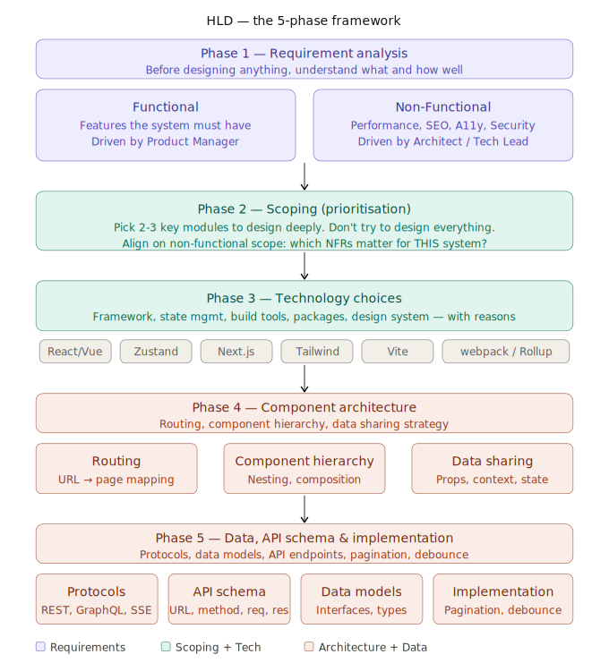

# 🏗️ High Level Design (HLD) — How to Approach It

> **Series**: Frontend System Design  
> **Chapter**: Introduction to HLD  
> **Goal**: Understand what HLD is, how to approach it systematically, and how to think during design interviews.

---

## Table of Contents

1. [What is HLD?](#1-what-is-hld)
2. [The HLD Framework — 5 Key Aspects](#2-the-hld-framework--5-key-aspects)
   - Requirement Analysis
   - System Architecture
   - Module / Component Design
   - Data Design, Interfaces & API Schema
   - Technology Choices
3. [The HLD Interview Approach](#3-the-hld-interview-approach)
4. [Interview Mindset — Key Takeaways](#4-interview-mindset--key-takeaways)
5. [The HLD Template](#5-the-hld-template)

---




## 1. What is HLD?

High Level Design is the **bridge between requirements and implementation**.

```
Requirements         HLD                    Implementation
(What to build)  ──► (Blueprint)       ──► (How to build it)
```

The goal of HLD is to produce a **blueprint or roadmap** that answers:
- What are the major components of this system?
- How do those components talk to each other?
- What data flows through the system?
- What technology decisions need to be made upfront?

> HLD is NOT about writing code. It is NOT about creating random boxes on a whiteboard. It is about demonstrating structured thinking — from problem to solution.

---

## 2. The HLD Framework — 5 Key Aspects

The image from the lecture captures this well — here is the full breakdown:

---

### Aspect 1 — Requirement Analysis

This is always the **first step**. You cannot design a system if you don't understand what it needs to do.

#### Functional Requirements
> "What should the system DO?"

Driven by the **Product Manager**. These are features.

```
Example: E-Commerce Platform

B2B vs B2C context
Module-level thinking:
  - User management (login, profile, account)
  - Help & Support
  - Account management
  - Payment gateway
  - Product listing
  - Cart Page
  - Subscription / Pricing

Feature-level thinking:
  - Search
  - Listing
  - Product Detail page
  - Add Item to Cart
  - Add Item to Wishlist
  - Cart List
  - Add / Remove Cart Items
```

#### Non-Functional Requirements
> "How WELL should the system do it?"

Driven by the **Architect / Tech Lead**. These are quality attributes.

```
Performance:
  - FCP (First Contentful Paint) < 1.8s
  - LCP (Largest Contentful Paint) < 2.5s
  - TTI (Time to Interactive) < 3.8s
  - CLS (Cumulative Layout Shift) < 0.1

Compatibility:
  - Mobile / Desktop first
  - Responsive / Adaptive layout
  - Cross-browser support
  - Accessibility (WCAG 2.1)

Reliability:
  - Caching strategy
  - Offline support (PWA)
  - Error handling

Other:
  - CSR / SSR decision
  - Security & Authentication
  - SEO requirements
  - Internationalization (i18n) / Localization (l10n)
  - A/B Testing support
  - Logging & Monitoring
  - CI/CD pipeline
  - Versioning
  - Micro-frontend architecture
```

---

### Aspect 2 — System Architecture

Once requirements are clear, you decide the **overall shape of the system**.

This is where you answer:
- What rendering pattern? (CSR / SSR / SSG / RSC)
- What folder structure?
- How are the major modules connected?
- What are the system boundaries?

```
Example Architecture Decision: E-Commerce

Product Listing Page → SSR (SEO critical, always fresh data)
Cart Page            → CSR (personalized, no SEO needed)
Category Pages       → SSG + ISR (stable content, SEO important)
Admin Dashboard      → CSR (internal tool, no SEO)
```

---

### Aspect 3 — Module / Component Design

Break the system into its logical pieces — **Component Architecture**.

Three sub-topics from Chirag's framework:

**Routing** — How does the user navigate between pages?
```
/ → Home
/products → Product listing
/products/:id → Product detail
/cart → Cart
/checkout → Checkout flow
```

**Component Hierarchy** — How are components nested?
```
App
 ├── Layout
 │    ├── Header (Nav, Search, Cart icon)
 │    └── Footer
 ├── ProductListingPage
 │    ├── FilterPanel
 │    ├── ProductGrid
 │    │    └── ProductCard (×N)
 │    └── Pagination
 └── ProductDetailPage
      ├── ImageGallery
      ├── ProductInfo
      ├── AddToCartButton (Client Component)
      └── ReviewSection
```

**Data Sharing** — How does data flow between components?
```
Options:
  - Props drilling (parent → child)
  - Context API (shared global state)
  - State management (Redux, Zustand, Jotai)
  - Server state (React Query, SWR)
  - URL state (query params)
```

---

### Aspect 4 — Data Design, Interfaces & API Schema

Define exactly what data looks like and how it moves.

#### Protocols
```
REST      — Standard CRUD, most common
GraphQL   — Client controls shape of data, good for complex UIs
gRPC/RPC  — High performance, binary protocol (backend-to-backend)
SSE       — Server-Sent Events (real-time, one-way push)
WebSocket — Real-time, bidirectional
```

#### Data Serialization
```
JSON            — Universal, human-readable
Protocol Buffers — Compact binary format (gRPC)
```

#### API Schema
For each API, define these five things:

| Field | Example |
|-------|---------|
| URL | `GET /api/products` |
| Method | `GET`, `POST`, `PUT`, `DELETE` |
| Request | Query params: `?page=1&limit=20&category=shoes` |
| Response | `{ data: [...], meta: { total, page } }` |
| Status codes | `200`, `400`, `401`, `404`, `500` |

```
Example APIs for E-Commerce:

getProductList()
  GET /api/products?page=1&limit=20&sort=price_asc&category=shoes
  Response: { data: Product[], meta: { total, page, pages } }

getProductDetail()
  GET /api/products/:id
  Response: { data: Product, related: Product[] }

addProductToCart()
  POST /api/cart/items
  Body: { productId: string, quantity: number }
  Response: { data: CartItem, cart: Cart }
```

#### Data Modeling — What does a Product look like?
```typescript
interface Product {
  id: string;
  name: string;
  description: string;
  price: number;
  discountedPrice?: number;
  images: string[];
  category: string;
  ratings: {
    average: number;
    count: number;
  };
  stock: number;
  createdAt: string;
}

interface CartItem {
  id: string;
  product: Product;
  quantity: number;
  addedAt: string;
}
```

#### Implementation Details
```
Pagination vs Infinite Scroll:
  - Pagination → SEO pages, predictable navigation (e-commerce listing)
  - Infinite Scroll → Feed-like content, social media

Debouncing vs Throttling:
  - Debounce → Search input (wait until user stops typing → fire once)
  - Throttle → Scroll events, resize (fire at most every N ms)

Component Design decisions:
  - state vs props (what lives where?)
  - Event handling (where does onClick live?)
  - Customization support (can consumers override styles?)
  - Theming (CSS variables, design tokens)
  - Reusability (is this a generic component or feature-specific?)
  - Data Source (where does the component get its data?)
```

---

### Aspect 5 — Technology Choices

Choose your tools intentionally, not by default.

```
Category           | Options                      | Decision Criteria
────────────────── | ──────────────────────────── | ──────────────────────────
Library/Framework  | React, Vue, Angular, Svelte  | Team expertise, ecosystem
State Management   | Redux, Zustand, Jotai, MobX  | App complexity, bundle size
Folder Structure   | Feature-based, Layer-based   | Team size, app scale
Packages           | React Query, Axios, Lodash   | Bundle cost, maintenance
Styling            | Tailwind, CSS Modules, SC    | Design system, team pref
Design System      | MUI, Radix, Shadcn, custom   | Speed vs customization
Build Tools        | Vite, webpack, Turbopack     | Speed, features needed
Special deps       | Canvas, SVG, WebRTC, D3      | Feature requirements
```

---

## 3. The HLD Interview Approach

From the lecture image, the full framework that interviewers expect is:

```
Phase 1: Requirements          Phase 2: Scoping              Phase 3: Tech Choices
─────────────────────          ──────────────────────         ──────────────────────
Functional                     Pick 2-3 key features          Library/Framework
  - B2B or B2C?                  - Product listing            State Management
  - What modules exist?          - Cart page                  Folder structure
  - What features per module?    - Search                     Packages & deps
                                 - Add to cart                Design System
Non-Functional                                                Build Tools
  - Mobile/desktop?            Non-Functional scope
  - Performance targets?         - Desktop/Responsive
  - Auth/Security?               - Accessibility
  - SEO requirements?            - Performance targets
  - Caching policy?              - CSR/SSR decision
                                 - Caching strategy

Phase 4: Component Architecture          Phase 5: Data / API / Implementation
────────────────────────────────         ──────────────────────────────────────
Routing structure                        Protocols (REST / GraphQL / SSE)
Component hierarchy (draw it!)           Serialization (JSON / Proto buffs)
Data sharing strategy                    API schema (URL, method, req, res)
                                         Implementation details
                                           (pagination, debounce, throttle)
                                         Component design
                                           (state, props, events, theming)
```

---

## 4. Interview Mindset — Key Takeaways

These are the most important principles from the lecture:

### Straight-forward vs Open-ended Problems
```
Junior interview:
  "Design a product listing page for Flipkart"
  → Requirements are clear, scope is obvious
  → Execute cleanly

Senior interview:
  "Design a frontend system for a large e-commerce platform"
  → Open-ended intentionally
  → You must ask clarifying questions to define the scope
  → How you drive the conversation IS the interview
```

### Topic doesn't decide intent — always ask clarifying questions

The interviewer says "design a search feature." That could mean:
- A simple text input with client-side filtering?
- A full search page with server-side results, filters, pagination?
- An autocomplete/typeahead component?
- An enterprise search with faceted filtering?

**Never assume. Ask.** Some good clarifying questions:
```
- Who is the user? (B2B internal tool vs B2C consumer product)
- What is the scale? (1K users/day vs 10M users/day)
- Is SEO important for this page?
- Should it work offline?
- What devices/browsers must it support?
- Is there a design system I should work within?
- What does success look like? (What metrics matter?)
```

### Drive the interview with the interviewer's intent

After you clarify, **propose your approach** and get alignment before diving in:

```
"Given what you've told me, I'll focus on the product listing and cart pages
 since those are the most critical for business. I'll use SSR for the listing
 (SEO matters) and CSR for the cart (personalized). Does that align with
 what you're looking for?"
```

This shows:
- You can prioritise
- You're not going to waste time on the wrong thing
- You understand the business context

### HLD is not about boxes

A common mistake: drawing a bunch of rectangles connected by arrows with no justification.

Every box must answer: **"Why does this component exist and what problem does it solve?"**

Every arrow must answer: **"What data flows here and why?"**

### HLD is not about coding

You are designing a system, not implementing it. In HLD:
- Sketch, don't code
- Reason about trade-offs
- Make and justify decisions
- Leave implementation details for LLD (Low Level Design)

---

## 5. The HLD Template

Use this as a starting structure for any HLD problem:

```markdown
## HLD: [System Name]

### 1. Clarifying Questions
- [ ] Who is the primary user?
- [ ] B2B or B2C?
- [ ] Scale expectations?
- [ ] SEO requirements?
- [ ] Auth required?
- [ ] Mobile/desktop priority?

### 2. Scoped Requirements
**Functional (prioritised):**
- Feature 1 — [reason for priority]
- Feature 2 — [reason for priority]

**Non-Functional:**
- Performance: FCP < 1.8s, LCP < 2.5s
- Rendering: SSR / CSR / SSG — [reason]
- Caching: [strategy]
- Accessibility: WCAG AA

### 3. Tech Choices
| Category | Choice | Reason |
|----------|--------|--------|
| Framework | React | Team familiarity |
| State | React Query + Zustand | Server vs client state |
| Rendering | Next.js SSR | SEO + personalization |
| Styling | Tailwind + CSS Modules | Utility + scoped |
| Build | Vite | DX + speed |

### 4. Component Architecture
**Routing:**
/ → HomePage
/products → ListingPage
/products/:id → DetailPage
/cart → CartPage

**Component hierarchy:**
[sketch it]

**Data sharing:**
[props / context / state manager decision]

### 5. API & Data Design
**APIs:**
- GET /api/products — list with filters
- GET /api/products/:id — detail
- POST /api/cart/items — add to cart

**Data models:**
[Product, CartItem, User interfaces]

**Implementation decisions:**
- Pagination or infinite scroll?
- Debounce on search?
- Optimistic updates on cart?
```

---

## Summary

```
HLD = Blueprint, not code
    = Trade-offs, not right answers
    = Communication, not just diagrams

5 Aspects:
  1. Requirements (functional + non-functional)
  2. System architecture (rendering pattern, boundaries)
  3. Module / component design (routing, hierarchy, data sharing)
  4. Data design / API schema (protocols, models, implementation)
  5. Technology choices (with reasoning)

Interview mindset:
  → Ask clarifying questions first
  → Drive with the interviewer's intent
  → Propose → align → execute
  → Every box must have a reason
```

---

*Next chapters will apply this framework to real systems:*
- *HLD: E-Commerce Product Listing*
- *HLD: Real-time Chat Application*
- *HLD: Social Media Feed*
- *HLD: Video Streaming Platform*
